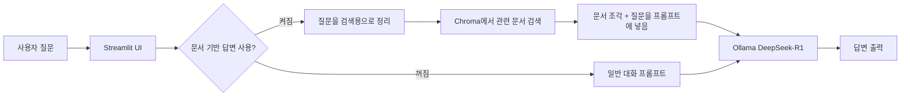

# DeepSeek-R1 로컬 RAG 챗봇

DeepSeek-R1을 로컬에서 돌려서 쓰는 문서 기반 챗봇이다.

## 뭐 하는 프로젝트냐

문서를 올리면 그 문서를 쪼개서 벡터DB에 넣고, 질문이 들어오면 관련 내용을 찾아서 DeepSeek-R1이 답변한다.

문서가 없으면 그냥 일반 챗봇처럼 대화하고, 문서를 인덱싱한 뒤 `문서 기반 답변`을 켜면 RAG 방식으로 답한다.

## 들어간 기능

- DeepSeek-R1 로컬 모델 사용
- Ollama로 로컬 LLM 실행
- LangChain 기반 챗봇 구조
- 멀티턴 대화
- PDF, DOCX, TXT, MD, CSV 업로드
- Chroma 벡터DB 연동
- 업로드 문서 기반 RAG 질의응답
- Streamlit 웹 UI
- Light / Dark 테마
- Windows 시작/종료 스크립트

## 사용 기술

| 구분 | 사용한 것 |
| --- | --- |
| 언어 | Python |
| UI | Streamlit |
| LLM | DeepSeek-R1 via Ollama |
| 챗봇 구조 | LangChain |
| 벡터DB | Chroma |
| 임베딩 | `sentence-transformers/paraphrase-multilingual-MiniLM-L12-v2` |
| 문서 처리 | `pypdf`, `docx2txt` |

## 구조

```text
.
├── app.py              # 메인 Streamlit 앱
├── styles.css          # Light / Dark 파스텔 테마
├── requirements.txt    # 필요한 Python 패키지
├── start.ps1           # 실행 스크립트
├── start.bat           # 더블클릭 실행용
├── stop.ps1            # 종료 스크립트
├── stop.bat            # 더블클릭 종료용
├── .env.example        # 설정 예시
└── README.md
```

실행하다가 생기는 `vector_store/`, `__pycache__/`, `artifacts/` 같은 건 다시 만들 수 있는 파일이라 Git에는 안 올린다.

## 실행 전에 필요한 것

기본적으로는 Ollama가 설치되어 있어야 한다.

Python은 PC에 없으면 `start.ps1`이 `winget`으로 Python 3.12 설치를 시도한다. `winget`이 막혀 있거나 설치 권한이 없으면 Python을 직접 설치해야 한다.

- 다운로드: https://ollama.com/download
- 기본 모델: `deepseek-r1:7b`

직접 받을 거면 이렇게 하면 된다.

```powershell
ollama pull deepseek-r1:7b
```

근데 `start.ps1`로 실행하면 Ollama 서버 실행이랑 모델 다운로드를 최대한 자동으로 처리하게 해뒀다.

## 실행 방법

PowerShell에서:

```powershell
cd D:\EPITECH\03
.\start.ps1
```

또는 그냥 `start.bat` 더블클릭해도 된다.

실행되면 여기로 들어가면 된다.

```text
http://localhost:8501
```

종료는:

```powershell
.\stop.ps1
```

또는 `stop.bat` 더블클릭.

## 모델 바꾸고 싶으면

기본은 답변 품질을 위해 `deepseek-r1:7b`로 잡았다.

PC 성능이 괜찮으면 더 큰 모델도 쓸 수 있다.

```powershell
.\start.ps1 -Model deepseek-r1:7b
```

앱에서 고를 수 있는 모델은 이렇다.

- `deepseek-r1:7b`
- `deepseek-r1:1.5b`
- `deepseek-r1:8b`
- `deepseek-r1:14b`

없는 모델을 고르면 먼저 받아야 한다.

```powershell
ollama pull deepseek-r1:7b
```

## 쓰는 순서

1. 앱을 실행한다.
2. 왼쪽 패널에서 모델이 준비됐는지 본다.
3. 문서를 업로드한다.
4. `문서 인덱싱`을 누른다.
5. `문서 기반 답변`을 켠다.
6. 질문한다.
7. 답변 밑에서 어떤 문서를 근거로 썼는지 확인한다.

## 내부 동작

흐름은 간단하다.



문서는 확장자에 맞게 텍스트를 뽑는다.

- PDF: `pypdf`
- DOCX: `docx2txt`
- TXT / MD / CSV: 텍스트로 읽음

뽑은 텍스트는 적당한 크기로 쪼갠 다음 Chroma에 저장한다. PDF는 페이지 정보도 같이 저장해서 근거에서 몇 페이지인지 확인할 수 있다. 질문이 들어오면 비슷한 내용만 반복해서 가져오지 않도록 MMR 방식으로 관련 문서 조각을 찾고, 그 내용을 같이 넣어서 DeepSeek-R1이 답변하게 만든다.

DeepSeek-R1이 가끔 `<think>...</think>` 같은 추론 블록을 내보낼 수 있어서, 화면에는 안 보이게 정리했다.

업로드 문서는 답변의 근거로만 취급한다. 문서 안에 모델에게 지시하는 문장이 있어도 그대로 따르지 않게 프롬프트를 넣었다.

## 환경 설정

기본값으로도 실행되지만, 바꾸고 싶으면 `.env.example` 보고 `.env`를 만들면 된다.

```env
OLLAMA_MODEL=deepseek-r1:7b
OLLAMA_BASE_URL=http://localhost:11434
```

## 문제 생기면

### Ollama 연결이 안 될 때

Ollama가 켜져 있는지 확인한다.

```powershell
ollama serve
```

귀찮으면 그냥 다시 실행한다.

```powershell
.\start.ps1
```

### 모델이 없다고 할 때

모델을 받으면 된다.

```powershell
ollama pull deepseek-r1:7b
```

### 답변이 느릴 때

로컬 모델이라 PC 성능 영향을 많이 받는다. 너무 느리면 `deepseek-r1:1.5b`로 낮추면 된다.

### 문서 답변이 이상할 때

문서를 다시 인덱싱하거나, 너무 큰 문서는 나눠서 올리는 게 낫다. RAG는 결국 검색된 문서 조각 품질에 영향을 많이 받는다.
